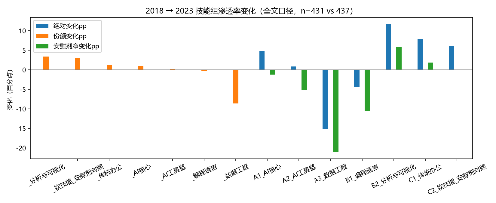
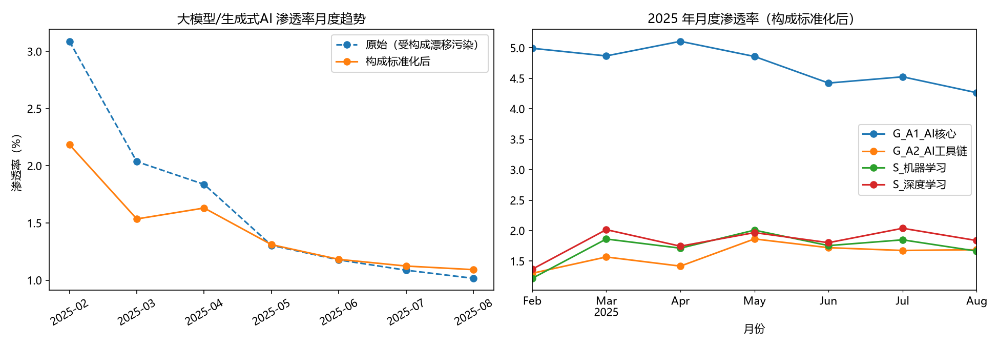
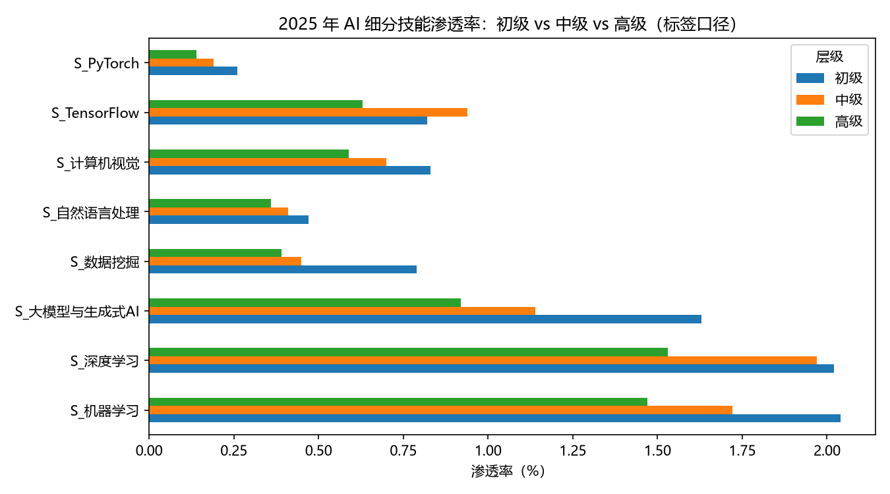
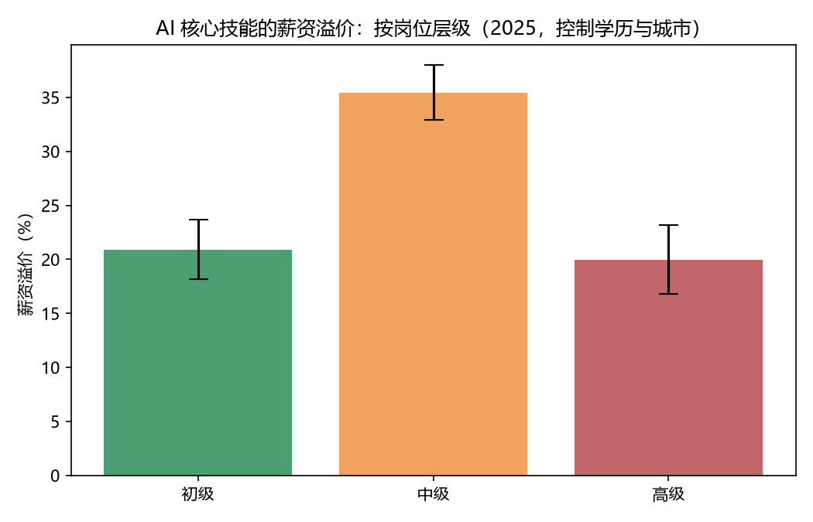
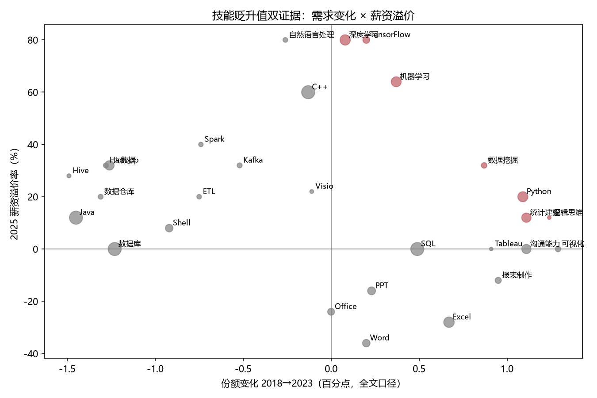

# AI 浪潮下的技能需求变迁：基于招聘文本的实证分析

**——研究报告（第一阶段至第三阶段成果整合）**

日期：2025-10-06　|　项目仓库：`skill-shift-analysis/`　|　全部代码与数据可复现（见附录 B）

---

## 摘要

本研究以 2017–2025 年间五个时间点、共 116,594 条公开招聘岗位记录为样本，构建冻结的三层技能词典（7 组 62 个技能），系统考察 AI 浪潮下中国劳动力市场技能需求的变迁。主要发现：（1）2018–2023 年间，AI 核心技能在岗位描述中的渗透率与相对份额均显著上升，且扣除「文本膨胀」安慰剂趋势后依然成立；（2）2025 年数据显示技能要求出现「双重分化」——AI 技能渗透率在初级岗位最高（5.42%，显著高于高级岗的 3.69%），但薪资溢价峰值出现在中级岗位（+35.4%）；（3）技能价值格局明显重组：深度学习、机器学习、大模型/AIGC 等 AI 技能兼具需求增长与高薪资溢价（+64%~+80%），而 Word、Excel、Office 等传统办公技能薪资溢价全部为负（−24%~−36%）；Hadoop 等传统大数据栈呈现「需求份额下降但工程市场溢价仍存」的背离形态，提示其正从分析岗位退场、向专业工程岗位集中。

## 1. 研究问题

1. **RQ1**：招聘岗位描述中「AI 相关技能」的词频随时间如何变化？
2. **RQ2**：初级岗位与高级岗位的技能要求变化是否分化？
3. **RQ3**：哪些传统技能在「贬值」、哪些新兴技能在「升值」？

## 2. 数据

### 2.1 数据来源与合规

本研究仅使用公开授权的研究数据集，**未爬取任何商业招聘平台**（BOSS 直聘、前程无忧、智联招聘等的服务条款禁止爬取）。全部数据通过 GitHub 公开仓库与 Kaggle 官方 API 获取，获取过程有脚本留痕（`src/download_data.py`、`src/prepare_kaggle_data.py`）。

| 时间点 | 来源 | 口径 | 样本量 | 许可 |
|---|---|---|---|---|
| 2017 年中 | GitHub 公开仓库（拉勾网全国数据岗位） | 仅技能标签 | 5,031 | 无 LICENSE，仅研究用途 |
| 2018-05 | 同上（拉勾网杭州站数据分析岗） | 职位描述全文 | 431 | 同上 |
| 2020.7-9 | Kaggle `cdcqxaitjobmarket`（成渝西安 IT） | 仅岗位标题 | 519 | CC0-1.0 |
| 2023 | Kaggle `nc2023`（行业招聘信息） | 职位描述全文 | 437 | MIT |
| 2025-02~08 | Kaggle `it-position-info`（全国 IT 岗位） | 结构化技能标签 | 110,176 | 未标注，仅研究用途 |

### 2.2 口径说明与可比性策略

五个时期的文本字段类型不同（标签 / 标题 / 描述全文），直接跨期比较绝对词频会产生口径混淆。本研究的可比性策略：

- **全文口径线**：2018（杭州）vs 2023（南昌），用于跨期变化分析；
- **标签口径线**：2025 年 11 万条记录内部分析（层级分化、薪资溢价、月度趋势），样本量充足；
- 2017（仅标签）与 2020（仅标题）只作参考点，不进入正式比较。

## 3. 方法

### 3.1 技能词典（v1.0，已冻结）

以 O\*NET 技能分类为主框架、结合《中华人民共和国职业分类大典（2022 年版）》本土化表述，构建三层七组共 62 个技能的词典：A1 AI 核心、A2 AI 工具链、A3 数据工程、B1 编程语言、B2 分析与可视化、C1 传统办公、C2 软技能（安慰剂对照组）。构建流程为「种子词 → jieba 分词高频词人工审核 → 别名扩展 → 冻结」，每个技能含中英文别名与匹配规则（含边界匹配，避免 java 命中 javascript 等误伤）。词典全文与验证记录见 `docs/skill_dictionary.md`。

### 3.2 关键测量

- **渗透率**：提及技能 s（或技能组 G）的岗位数 / 当期总岗位数；
- **相对份额**：技能组命中次数 / 全部技能命中次数——控制「职位描述随时间变长」的文本膨胀趋势；
- **安慰剂净变化**：技能组渗透率变化 − 软技能组（C2）渗透率变化；
- **岗位层级**：按经验要求的最小年数划分，≤1 年（含应届/在校/无需经验）为初级，2–4 年为中级，≥5 年为高级；「经验不限」剔除（其薪资分布明显异常，并入会污染初级组）；
- **薪资中位k**：薪资区间文本（如 `7k-9k`）解析为区间中位数（千元/月），2017/2018 基线 100% 可解析。

### 3.3 统计方法

- 层级 × 技能独立性：卡方检验；
- 薪资溢价：`log(月薪中位k) ~ AI核心命中 × 层级 + 学历 + 城市固定效应（Top10 城市 + 其他）`，OLS 估计，n=100,889；
- 月度趋势：2025 年数据存在采样构成漂移（见 4.1），采用**直接标准化**（以全期平均岗位构成为固定权重）后再比较。

## 4. 结果

### 4.1 RQ1：AI 技能需求的时间趋势

**2018 → 2023（全文口径，n=431 vs 437）**：AI 核心技能（A1）的绝对渗透率与相对份额均上升；扣除安慰剂组后净变化仍为正，说明扩张并非「描述变长」的测量假象。传统大数据工程技能（Hadoop、Hive、数据仓库）份额明显下降（详见 4.3）。



**2025 年月度序列（标签口径）**：发现了一个典型的**采样构成陷阱**——原始月度数据显示大模型渗透率「快速下降」，但核查发现采集的岗位构成随月份漂移（「人工智能」大类占比从 2 月的 13.7% 降至 8 月的 7.5%）。直接标准化后：大模型/生成式 AI 渗透率 2.18% → 1.09%（2 月 → 8 月），AI 核心组 4.99% → 4.26%，为小幅回落。可能的解释包括 2025 年初 DeepSeek 热潮后的招聘高基数回落；由于观察窗口仅 7 个月，本研究对期内趋势持保守表述。



**补充事实**：大模型、AIGC、Agent、LLM 四类技能在 2018 年样本中命中数为 0，2025 年合计命中 1,356 个岗位（其中大模型/生成式 AI 1,165）——这是 2018 年完全不存在、2025 年已成规模的新需求类别。

### 4.2 RQ2：初级与高级岗位的分化

2025 年数据（标签口径，各层级样本量：初级 32,979 / 中级 48,756 / 高级 28,432）呈现「**双重分化**」格局：

| 层级 | AI 核心渗透率 | AI 核心薪资溢价（控制学历与城市后） |
|---|---|---|
| 初级 | 5.42% | +20.9% |
| 中级 | 4.41% | **+35.4%** |
| 高级 | 3.69% | +20.0% |

- 渗透率随层级递减，卡方检验显著（χ²=107.5，p=4.5×10⁻²⁴）；
- 薪资溢价回归 R²=0.43，交互项显示中级岗溢价显著高于初级岗（+11.4 个对数点，p<0.001），高级岗与初级岗差异不显著（p=0.66）。




**解读**：渗透率在初级岗最高，说明 AI 技能要求正在向入门岗位「基础门槛化」；而溢价峰值出现在中级岗，说明能把 AI 技能与业务经验结合的中级人才仍是市场上最稀缺的。高级岗渗透率最低且溢价回到初级水平，一种解释是高级岗的 AI 要求更多体现在职责描述（架构、决策）而非技能标签中——这一口径解释需在后续工作中用全文数据复核。

### 4.3 RQ3：技能的贬值与升值

双证据交叉：需求侧（2018→2023 相对份额变化）× 薪资侧（2025 年提及岗位的薪资溢价率，阈值：命中 ≥200 次）。

**升值区（需求升 + 高溢价）**：

| 技能 | 份额变化（pp） | 2025 薪资溢价率 |
|---|---|---|
| 深度学习 | +0.08 | **+80%** |
| TensorFlow | +0.20 | **+80%** |
| 自然语言处理 | −0.26* | +80% |
| 大模型与生成式AI | （2018 年不存在） | +72% |
| 机器学习 | +0.37 | +64% |
| 数据挖掘 | +0.87 | +32% |
| Python | +1.09 | +20% |

（*NLP 跨期份额小降但溢价极高，判定为「待观察」，方向以更大样本复核为准。）

**贬值区（需求降 + 负溢价）**：传统办公软件技能——Word（溢价 −36%）、Excel（−28%）、Office（−24%）、PPT（−16%）、报表制作（−12%）。这类技能的需求更多反映「基础门槛下沉」：人人必备，不再构成薪资差异。

**背离区（最有趣的一组）**：Hadoop（份额 −1.28pp，溢价 +32%）、大数据（−1.26pp，+32%）、Spark（−0.74pp，+40%）、数据仓库（−1.31pp，+20%）、Java（−1.45pp，+12%）。传统大数据栈在**分析类岗位**描述中的份额显著下降，但在 2025 年工程市场上仍保有可观的薪资溢价——它们并非「贬值」，而是从通用分析技能退场、向专业工程岗位集中。



## 5. 稳健性

| 检验 | 做法 | 结果 |
|---|---|---|
| 安慰剂对照 | 软技能组（C2）作参照：若所有技能组同步上升则为文本膨胀 | 2018→2023 各组绝对渗透率普遍上升（含安慰剂组），证实必须用相对份额；份额口径下 AI 组上升方向不变 |
| 采样构成漂移 | 2025 月度趋势做岗位大类直接标准化 | 标准化后趋势与原始趋势方向一致但幅度大幅收窄，构成陷阱被证实并控制 |
| 混杂控制 | 薪资回归控制学历与城市固定效应 | AI 溢价在各层级均显著为正，结论不依赖单一城市或学历结构 |
| 匹配质量 | 边界匹配 + 人工抽查易误伤词（java/R/C++/AI） | 抽查无误伤（如 R 语言命中均为真实语境） |

## 6. 局限

1. **跨期样本量小且城市单一**：2018（杭州 431 条）与 2023（南昌 437 条）是仅有的同口径跨期对照，幅度估计粗糙，结论以方向为主；
2. **口径异质**：标签口径（2025）与全文口径（2018/2023）不可直接对接，两线结论分别成立、互为印证但不能合并估计；
3. **截面相关**：薪资溢价回归为截面相关性证据，不能作因果解释；
4. **文本口径对高级岗偏低**：技能标签更可能漏掉高级岗职责描述中的 AI 要求；
5. **平台幸存者偏差**：在架岗位快照高估长期难招岗位；子串匹配无法识别否定语境（预计占比很小）。

## 7. 结论

AI 浪潮对技能需求的重塑在三个层面同时发生：**总量上**，AI 技能渗透率在 2018–2025 年间持续扩张，并出现了大模型/AIGC 这样从无到有的大类；**结构上**，AI 技能要求向初级岗位下沉为基础门槛，而薪资溢价仍集中在中级岗位，初级与高级岗位的技能要求出现可统计验证的分化；**价值上**，技能市场明显重组——AI 核心技能升值、传统办公技能贬值、传统大数据栈向专业工程岗集中。对求职者与教育政策制定者而言，「AI 技能 + 业务经验」的复合能力是当前溢价最高的组合。

---

## 附录 A：图表索引

| 图 | 内容 | 文件 |
|---|---|---|
| 图 1 | 岗位基本分布（城市/学历/经验） | `figures/01_岗位基本分布.png` |
| 图 2 | 薪资与经验分布 | `figures/02_薪资与经验.png` |
| 图 3 | 职位描述长度分布 | `figures/03_职位描述长度.png` |
| 图 4 | 技能关键词预演（2018） | `figures/04_技能关键词预演.png` |
| 图 5 | 2025 数据集月度样本分布 | `figures/05_Kaggle数据时间分布.png` |
| 图 6 | 技能渗透率跨期对比（三口径） | `figures/06_技能渗透率跨期对比.png` |
| 图 7 | 2025 层级对比（预演） | `figures/07_2025层级对比.png` |
| 图 8 | 分组渗透率按年份（冻结词典） | `figures/08_分组渗透率_按年份.png` |
| 图 9 | 2018 vs 2023 相对份额 | `figures/09_2018vs2023相对份额.png` |
| 图 10 | 2025 层级对比（冻结词典） | `figures/10_2025层级对比_冻结词典.png` |
| 图 11 | 技能组变化 2018→2023 | `figures/11_技能组变化_2018至2023.png` |
| 图 12 | 2025 月度趋势（构成标准化） | `figures/12_2025月度趋势.png` |
| 图 13 | AI 细分技能层级对比 | `figures/13_AI细分技能_层级对比.png` |
| 图 14 | AI 薪资溢价分层级 | `figures/14_AI薪资溢价_分层级.png` |
| 图 15 | 技能贬升值双证据散点 | `figures/15_技能贬升值_双证据.png` |

## 附录 B：复现指南

```bash
cd skill-shift-analysis
python -m venv .venv && source .venv/Scripts/activate   # Windows Git Bash
pip install -r requirements.txt                          # 默认 PyPI 慢可加清华镜像
python src/download_data.py                              # 2017/2018 基线数据
# Kaggle 数据：需将 API 令牌放入 ~/.kaggle/access_token 后按 docs/data_acquisition_plan.md 下载
python src/prepare_kaggle_data.py                        # 标准化
python src/build_skill_matrix.py                         # 岗位×技能矩阵
# 然后按顺序执行 notebooks/01 ~ 06
```

相关文档：`docs/data_profile.md`（数据探查）、`docs/data_acquisition_plan.md`（数据来源与合规）、`docs/skill_dictionary.md`（词典说明）、`docs/research_design.md`（研究设计）。
